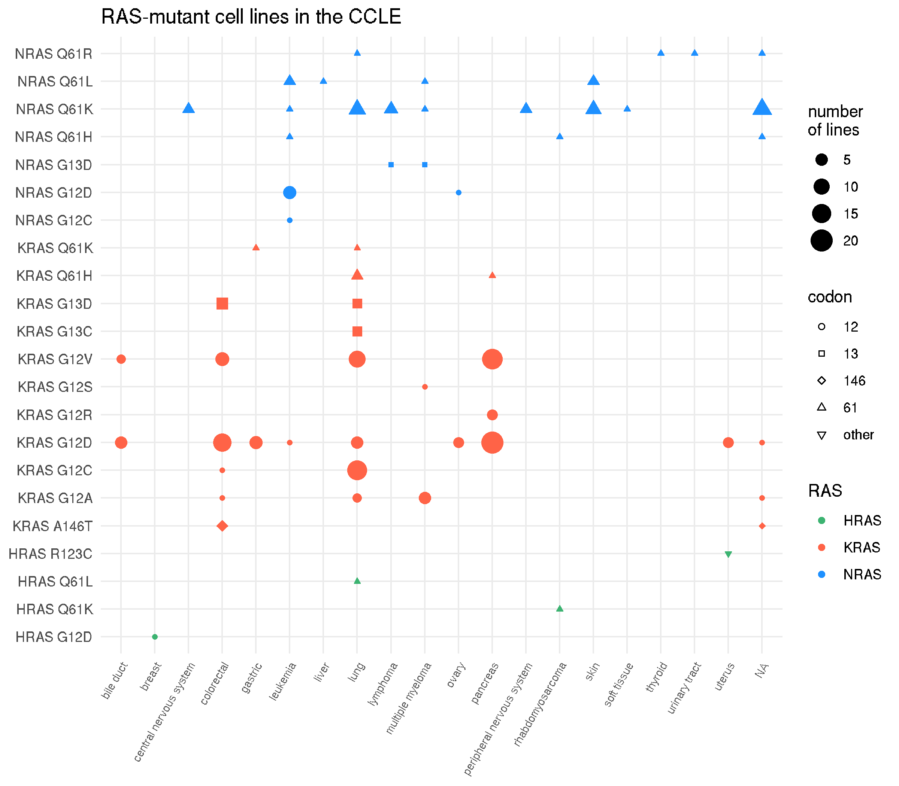
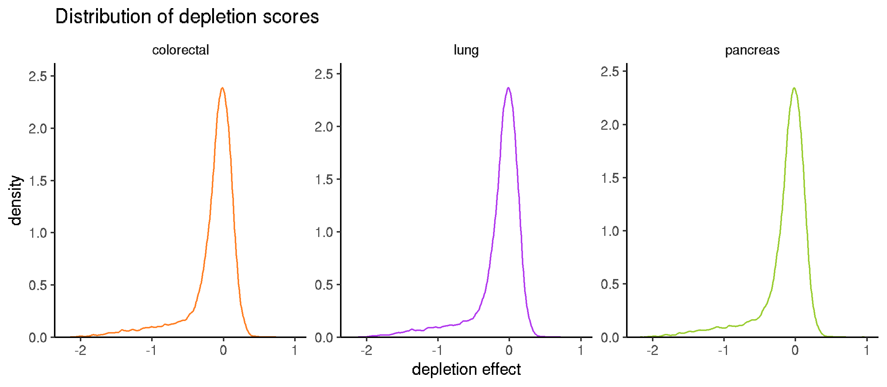

```{r setup, echo = FALSE, warning = FALSE, message = FALSE}
knitr::opts_chunk$set(
    echo = TRUE,
    comment = "#>",
    eval = TRUE,
    warning = TRUE,
    message = TRUE,
    cache = FALSE,
    cache.lazy = FALSE,
    dpi = 200
)

library(magrittr)
library(tidyverse)

set.seed(0)
```

# Purpose

The goal of this analysis is to identify synthetic lethal interactions with *KRAS* G13D mutations.

# Data {.tabset}

The data is from the genome-wide CRISPR-Cas9 loss-of-function screen named "Achilles" from the [DepMap Project](https://depmap.org/portal/). This data was downloaded, cleaned, and made available in the ['tidy_Achilles' GitHub repository](https://github.com/jhrcook/tidy_Achilles).

## The cell lines

The following plot shows the number of cell lines in CCLE with either a *KRAS* or *NRAS* mutation (only showing alleles found in at least two cell lines of a disease).



However, the DepMap has yet to screen all of the CCLE cell lines. The following only includes the cell lines used in Achilles.


```{r get_idsscreened, cache = TRUE}
ids_screened <- readRDS(file.path("data", "Achilles_gene_effect.tib")) %>%
    pull(dep_map_id) %>%
    unlist() %>%
    unique()
```

As of the 2019Q2 release, there are `r n_distinct(ids_screened)` screened cell lines. The most frequent allele is *KRAS* G12D, and the organs with the most frequent *KRAS* mutants are colorectal, lung, and pancreas. The following table shows the number of cell lines with each *KRAS* allele.

```{r table_rasalleles}
readRDS(file.path("data", "ras_mutants_info.tib")) %>%
    filter(dep_map_id %in% !!ids_screened & ras == "KRAS") %>%
    count(ras_allele, disease) %>%
    filter(n >= 2) %>%
    mutate(disease = str_to_title(str_replace_all(disease, "_", " ")),
           ras_allele = str_replace_all(ras_allele, "_", " ")) %>%
    arrange(disease, desc(n)) %>%
    dplyr::rename(`RAS allele` = "ras_allele",
                  `Origin of cell line` = "disease",
                  `num. of cell lines` = "n")
```

## The dependency scores

Below are the distributions of the depletion scores in the three organs with the highest frequency of *KRAS* mutations.



They are not normally distributed. Instead, most of the values lie near 0, indicating that most knock-out events had little impact on the viability of the cell lines (as expected). There is a tail to the left filled with the genes that did have an effect when knocked-out.


# Linear model

(Analysis conducted in `subscripts/linear_model.R`.)

## *KRAS* G13D vs *KRAS* G12 vs. WT and target gene mutation {.tabset}

### The model

The first attempt at modeling the data used a standard linear model to estimate the depletion effect given the *KRAS* allele and mutation status of the target gene. The model had two covariates, *KRAS* allele and the mutational status of the target gene (binary). The alleles were grouped as *KRAS* codon 12, *KRAS* G13D, or WT. Only genes that caused a depletion to -0.5 or lower in at least one cell line were used.

Cell lines were not used if they had multiple *KRAS* mutations or a mutation in *NRAS* or *A/B/CRAF*.

The volcano plot below shows the difference in the estimates for *KRAS* G12 and *KRAS* G13D and the log-transformed BH FDR-adjusted p-value (q-value) of the model. The labeled genes had a model q-value less than 0.20 and a difference in estimate of magnitude greater than 0.2. The points to the left (blue) had a stronger depletion effect in *KRAS* G12 mutants where the points to the right (red) had a stronger depletion effect in *KRAS* G13D.


### G13D-specific depletion

The plot shows target genes that had a significantly stronger depletion effect in *KRAS* G13D cell lines. These genes showed increased depletion in *KRAS* G13D cell lines, had a model q-value below 0.20, and a p-value for the G13D covariate below 0.05.


### G13D-specific survival

On the other hand, the following plot shows target genes that had a significantly stronger *survival* effect (relative to the other alleles tested) in *KRAS* G13D cell lines. I use the term "survival" here due to a lack of a better option, but "reduced synthetic lethality" or "reduced depletion effect" may be more accurate.


## Only G12 and G13D

I have additionally fit the same model without WT samples, thus the intercept was the *KRAS* G12 effect and other covariates were *KRAS* G13D and mutational status of the target. Looking at the target genes that could be modeled and how their results compare to the previous version of the model (with WT), they do not capture any new effects. I believe including the WT as the intercept is a logical inclusion.

## Including gene expression of the target gene {.tabset}

I ran the same model as before, including *KRAS* WT, G12, and G13D and whether the target gene was mutated or not, now including the RNA expression levels of the target gene in each cell line. 

### Volcano plot of *KRAS* G13D estimate

The following plot is a volcano with the *KRAS* G13D effect on the x-axis and log-transformed p-value of the *KRAS* G13D coefficient on the y-axis. The highlighted genes had an overall model q-value below 0.20, *KRAS* G13D p-value below 0.05, and a *KRAS* G13D estimate of magnitude greater than 0.20.


### Genes with increased depletion with *KRAS* G13D

The plot shows target genes that had a significantly stronger depletion effect in *KRAS* G13D cell lines. These genes showed increased depletion in *KRAS* G13D cell lines, had a model q-value below 0.20, and a p-value for the G13D covariate below 0.05.


### Genes with decreased depletion with *KRAS* G13D

The plot shows target genes that had a significantly stronger depletion effect in *KRAS* G13D cell lines. These genes showed increased depletion in *KRAS* G13D cell lines, had a model q-value below 0.20, and a p-value for the G13D covariate below 0.05.


### Comparing coefficients of *KRAS* G12D and G13D

The plot below compares the coefficients fit to *KRAS* G12 (x-axis) and G13D (y-axis). Values that lie along the dashed line showed no difference in depletion effects between the two mutant *KRAS* groups. The highlighted genes had significant models (q_value < 0.20) and a difference in coefficients of 0.2 in magnitude. 


### Effects of gene expression

The following plots show the trend of gene expression with depletion score for models found to have a significant coefficient and estimate (slope) of at least 0.15 in magnitude.


### Effect of mutational status of theo target gene

Inspecting the target genes that had statistically significant coefficients for the mutational status covariate (non-synonymous mutations only) revealed that many models were significant with only one or two cell lines with a mutation. The plot below shows the models with significant mutational status coefficients with an effect size of at least 0.15 in magnitude and at least four cell lines with a mutation in the gene.


## Conditional mutational status {.tabset}

From the previous observation that some models were fitting significant and relatively large coefficients to the mutational status covariate when only couple of cell lines had a mutation, I restricted the inclusion of this covariate to models of genes mutated in at least four cell lines. 

The following plots have the same layout as in previous models, so are not specifically explained in each tab.

### Genes with increased depletion with *KRAS* G13D


### Genes with decreased depletion with *KRAS* G13D


### Comparing coefficients of *KRAS* G12D and G13D


## Additional Analysis of hits

I looked at the frequency of co-mutation of the genes identified by the linear model with *KRAS* G12, *KRAS* G13D, and WT in human tumor samples from COAD, LUAD, and PAAD. Below is a heatmap colored by co-mutation frequency. The numbers in the cells indicate the number of co-mutation events.


The following heatmap has the same information, however the fill color indicates the co-mutation frequency scaled from 0 to 1 for each gene individually. This gives an indication of the relative rates of co-mutation for each gene.


---

There is currently minimal code in the README, however, it will be added at the end from the scripts where the analysis was originally done. The end goal is for the README to be a fully reproducible document on its own.