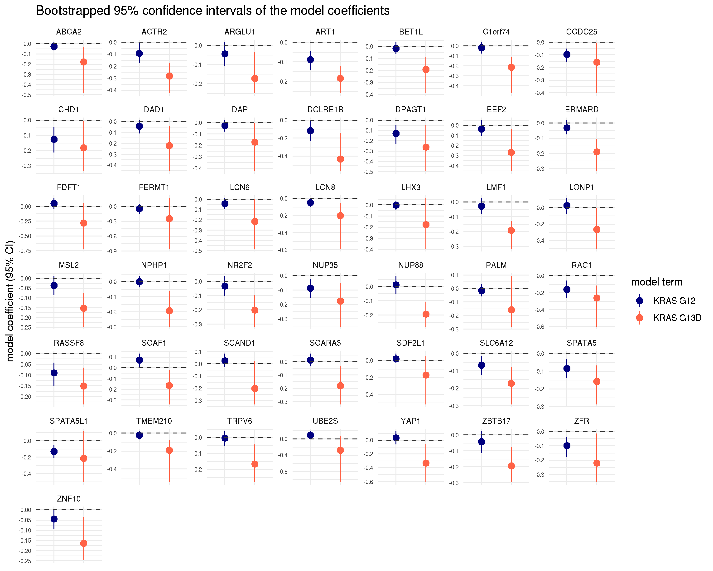
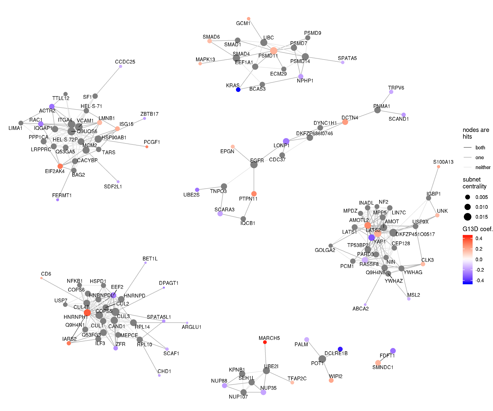
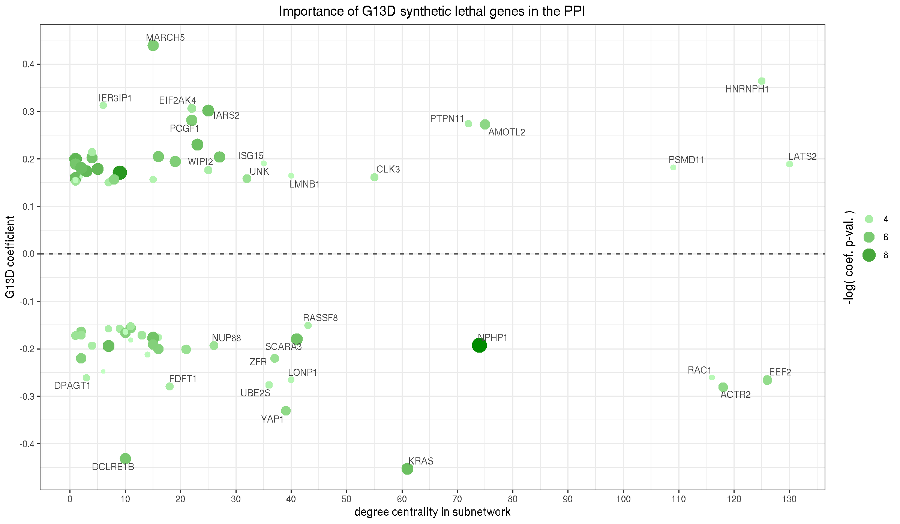
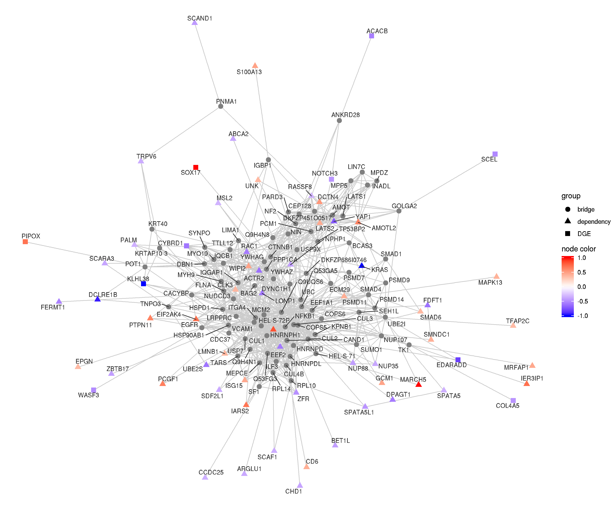
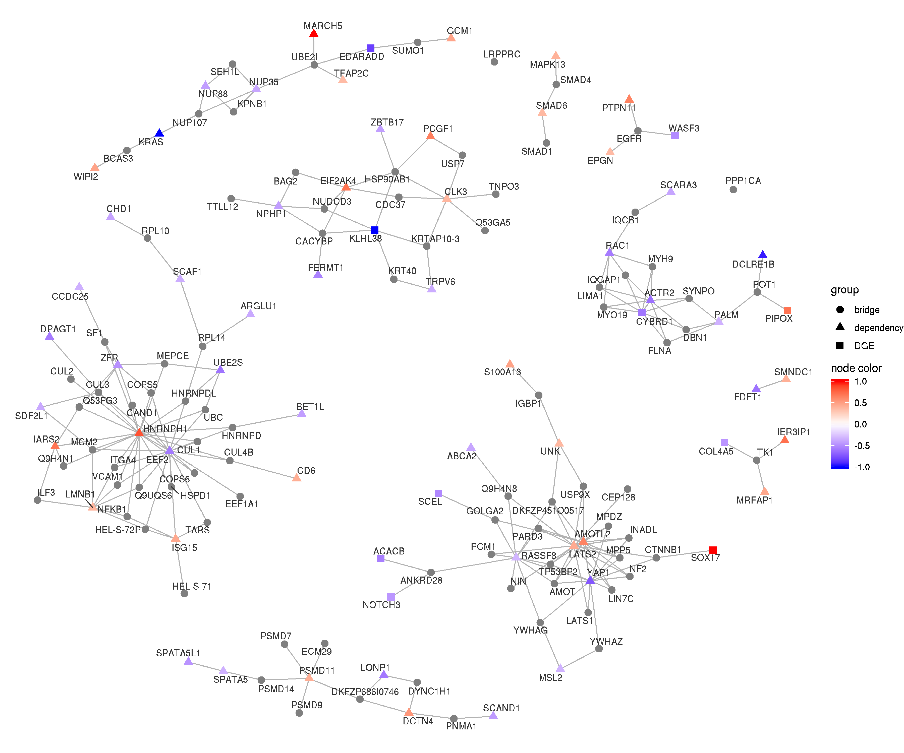
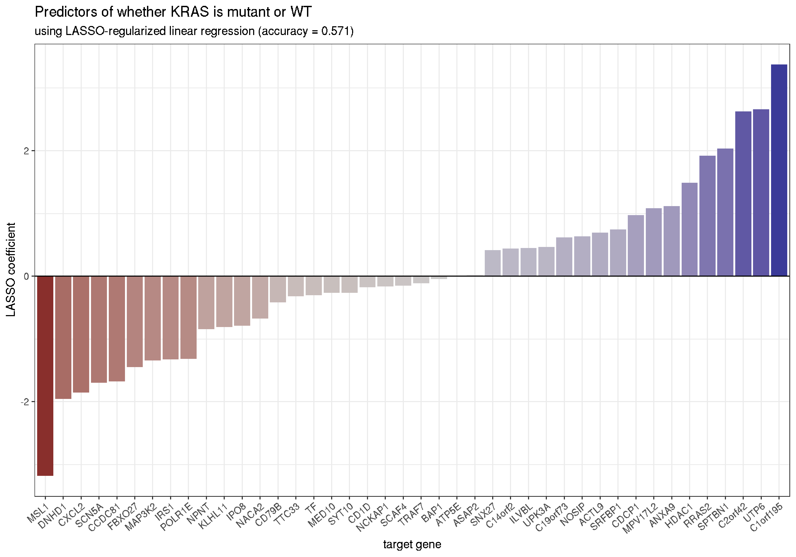
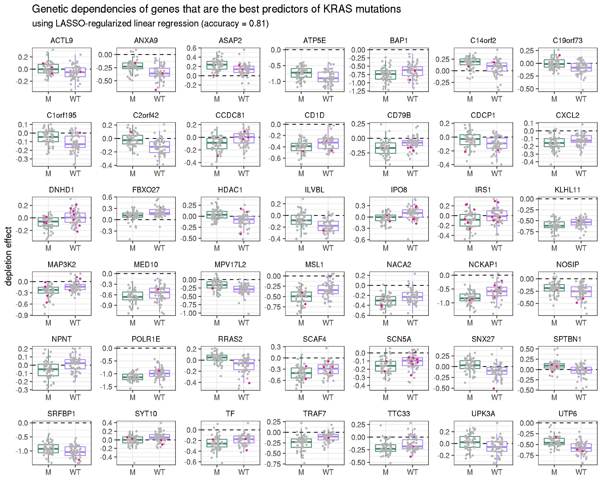
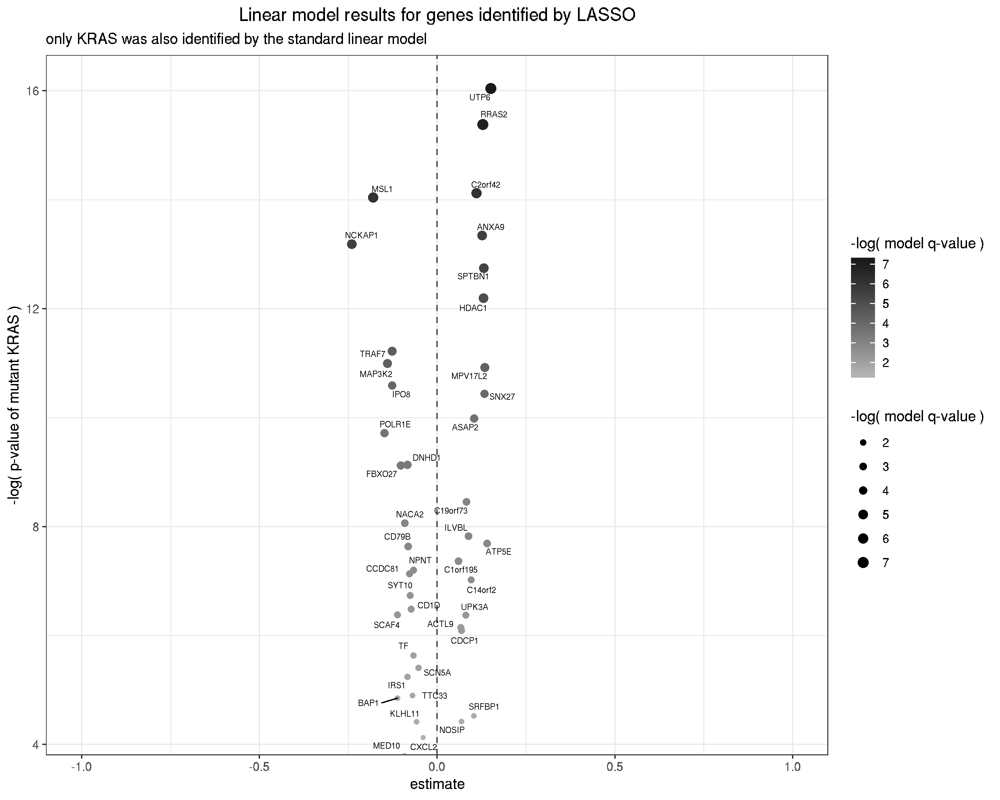
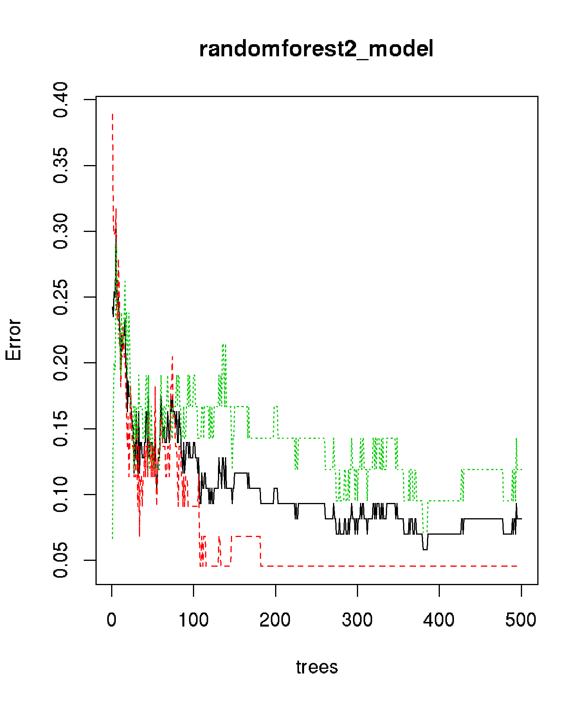

# Overview

**Purpose**

The goal of this analysis is to identify synthetic lethal interactions with *KRAS* G13D mutations.

**Data**

The [Dependency Mapping](https://depmap.org/portal/) project ([Howard *et al.*, 2016](http://symposium.cshlp.org/content/81/237.long); [Tsherniak *et al.*, 2017](https://www.cell.com/cell/abstract/S0092-8674(17)30651-7); [Meyers *et al.*, 2017](https://www.nature.com/articles/ng.3984)) has screened over 500 cell lines from the [Cancer Cell Line Encyclopedia (CCLE)](https://portals.broadinstitute.org/ccle) through Achilles ([Cheung *et al.*, 2011](http://www.pnas.org/cgi/pmidlookup?view=long&pmid=21746896)). Achilles is a genome-wide CRISPR-Cas9 loss-of-function screen where each gene in every cell line was knocked out with 6 different guide RNA (using the Avana sgRNA library ([Doench *et al.*, 2014](https://doi.org/10.1038/nbt.3026); [Doench *et al.*, 2016](https://www.nature.com/articles/nbt.3437))).

The source of the data and some descriptive figures are available in the [Data](#Data) section, below.

**Modeling**

I present below in [Linear Models](#LinearModels) several models that all try to explain the effect of knocking out a gene using the features of the cell line. Thus, one model is constructed for each targeted gene. The attributes of the cell lines that I consider are the *KRAS* allele, whether the target gene is mutated, and the RNA expression of the target gene. For most models, the *KRAS* alleles are grouped into *KRAS* WT, *KRAS* G12, and *KRAS* G13D, though I also have an example of only using *KRAS* G12 and G13D, and an example of using *KRAS* WT, G12*D*, and G13D.

In each model, I separate the genes with interactions with *KRAS* G13D into two groups, those where knocking out the gene had a larger depletion effect (stronger genetic dependency) and those with a weaker depletion effect (reduced genetic dependency). While the former is more relevant to the study at hand, the latter can still provide some insight into the differences between *KRAS* G12 and G13D alleles.

For each model, I created a set of figures to describe the results (though I was not perfectly consistent with creating each figure for each model). They are available in tabs within each model's subsection.

**Additional Analysis**

I present various follow-up analyses in the section [Additional analysis of hits](#Additionalanalysisofhits) to provide some insight into the genes identified to have synthetic lethal interactions with *KRAS* G13D. This includes the frequency of co-mutation with the *KRAS* alleles in human tumors, a functional enrichment (rather unfruitful), an inspection of the protein-protein interaction network that contained the genes, and a comparison to the results of the differential gene expression between *KRAS* G12D and *KRAS* G13D mice.

Finally, I provide a list of genes that I would recommend using for further validation in the [Final conclusions](#Finalconclusions) subsection. I also provide some brief information about each gene and links to their [UniProt](https://www.uniprot.org) and [STRING](https://string-db.org/cgi/input.pl?sessionId=JnVnsTgQxlQZ&input_page_show_search=on) pages.

**Predicting *KRAS* mutation using depletion effects**

(The [Predicting *KRAS* mutation using depletion effects](#PredictingKRASmutationusingdepletioneffects) section is not specifically relevant to the current study.)

Instead of estimating the effect of targeting a gene using features of the cell lines, I created models to predict whether *KRAS* was WT or mutated in a cell line by the effects of knocking out each of its genes. Eventually, I was able to predict whether *KRAS* was mutated or not with high fidelity using about 25 genes (not including *KRAS*). These genes may reveal some features of mutant *KRAS*, though further analysis is required.


# Data {#Data .tabset}

The data is from the genome-wide CRISPR-Cas9 loss-of-function screen Achilles from the [DepMap Project](https://depmap.org/portal/). This data was downloaded, cleaned, and made available in the ['tidy_Achilles' GitHub repository](https://github.com/jhrcook/tidy_Achilles).

## The cell lines

The following plot shows the number of cell lines in the CCLE with either a *KRAS*, *NRAS*, or *HRAS* mutation (only showing alleles found in at least two cell lines from the same anatomical location).


However, the DepMap has yet to screen all of the CCLE cell lines. The following only includes the cell lines that have passed through Achilles.


```r
achilles_data <- readRDS(file.path("data", "Achilles_gene_effect.tib"))

ids_screened <- achilles_data %>%
    pull(dep_map_id) %>%
    unlist() %>%
    unique()
    
genes_total <- achilles_data %>% pull(gene) %>% n_distinct()
genes_used <- readRDS(file.path("model_results", "linear_model_1_data.rds")) %>% pull(gene) %>% n_distinct()
```

As of the 2019Q2 release, there are 563 screened cell lines. The most frequent allele is *KRAS* G12D, and the organs with the most frequent *KRAS* mutants are colorectal, lung, and pancreas. The following table shows the number of cell lines with each *KRAS* allele.


```r
readRDS(file.path("data", "ras_mutants_info.tib")) %>%
    filter(dep_map_id %in% !!ids_screened & ras == "KRAS") %>%
    count(ras_allele, disease) %>%
    filter(n >= 2) %>%
    mutate(disease = str_to_title(str_replace_all(disease, "_", " ")),
           ras_allele = str_replace_all(ras_allele, "_", " ")) %>%
    arrange(disease, desc(n)) %>%
    dplyr::rename(`RAS allele` = "ras_allele",
                  `Origin of cell line` = "disease",
                  `num. of cell lines` = "n")
```

<div data-pagedtable="false">
  <script data-pagedtable-source type="application/json">
{"columns":[{"label":["RAS allele"],"name":[1],"type":["chr"],"align":["left"]},{"label":["Origin of cell line"],"name":[2],"type":["chr"],"align":["left"]},{"label":["num. of cell lines"],"name":[3],"type":["int"],"align":["right"]}],"data":[{"1":"KRAS G12D","2":"Bile Duct","3":"3"},{"1":"KRAS G12D","2":"Colorectal","3":"3"},{"1":"KRAS G12V","2":"Colorectal","3":"3"},{"1":"KRAS G13D","2":"Colorectal","3":"3"},{"1":"KRAS G12C","2":"Colorectal","3":"2"},{"1":"KRAS G12D","2":"Gastric","3":"4"},{"1":"KRAS G12C","2":"Lung","3":"9"},{"1":"KRAS G12V","2":"Lung","3":"4"},{"1":"KRAS G12A","2":"Lung","3":"2"},{"1":"KRAS G12D","2":"Lung","3":"2"},{"1":"KRAS G13D","2":"Lung","3":"2"},{"1":"KRAS Q61H","2":"Lung","3":"2"},{"1":"KRAS Q61K","2":"Lung","3":"2"},{"1":"KRAS G12A","2":"Multiple Myeloma","3":"2"},{"1":"KRAS G12D","2":"Ovary","3":"4"},{"1":"KRAS G12D","2":"Pancreas","3":"9"},{"1":"KRAS G12V","2":"Pancreas","3":"7"},{"1":"KRAS G12R","2":"Pancreas","3":"4"},{"1":"KRAS Q61H","2":"Pancreas","3":"2"},{"1":"KRAS G12D","2":"Uterus","3":"2"}],"options":{"columns":{"min":{},"max":[10]},"rows":{"min":[10],"max":[10]},"pages":{}}}
  </script>
</div>

## The dependency scores

Below are the distributions of the depletion scores in the three organs with the highest frequency of *KRAS* mutations. Note that a negative score indicates depletion of the cell line after the knock-out event.

They are not normally distributed. Instead, most of the values lie near 0, indicating that most knock-out events had little impact on the viability of the cell lines (as expected). There is a tail to the left filled with the genes that did have an effect when knocked-out.


# Linear Models {#LinearModels}

(Analysis conducted in `subscripts/linear_model.R`.)

For all of the following analyses, these two conditions were met:

1. Only genes that caused a depletion score of -0.25 or lower in at least one cell line were used. This decreased the number of genes used from 17634 to 14314.
2. Cell lines were not used if they had multiple *KRAS* mutations or an activating mutation in *NRAS* or *BRAF*.


## *KRAS* G13D vs *KRAS* G12 vs. WT {.tabset}

The first attempt at modeling the data used a standard linear model to estimate the depletion effect given the *KRAS* allele, grouped as either WT, *KRAS* G12, or *KRAS* G13D.

### Volcano plot of *KRAS* G12 - G13D estimate

The volcano plot below shows the difference in the estimates for *KRAS* G12 and *KRAS* G13D and the log-transformed Benjamini-Hochberg FDR-adjusted p-value (hereinafter referred to as q-value) of the model. The labeled genes had a model q-value less than 0.20 and a difference in estimate of magnitude greater than 0.2. The points to the left (blue) had a stronger depletion effect in *KRAS* G12 mutants where the points to the right (red) had a stronger depletion effect in *KRAS* G13D.

The genes with very low model q-values but little difference between *KRAS* G12 and G13D estimates (middle of the x-axis and high on the y-axis) were likely highly predicted by the WT covariate (i.e. the gene effect did not change much according to the *KRAS* allele).


### Comparing coefficients of *KRAS* G12D and G13D

The plot below compares the coefficients fit to *KRAS* G12 (x-axis) and G13D (y-axis). Values that lie along the dashed line showed no difference in depletion effects between the two mutant *KRAS* groups. The highlighted genes had significant models (q-value < 0.20) and a difference in coefficients of 0.2 in magnitude. 


### Genes with increased depletion with *KRAS* G13D

This figure shows target genes that had a significantly stronger depletion effect in *KRAS* G13D cell lines. These genes showed increased depletion in *KRAS* G13D cell lines, had a model q-value below 0.20, and a p-value for the G13D coefficient below 0.05.


### Genes with reduced depletion with *KRAS* G13D

On the other hand, the following plot shows target genes that had a significantly weaker/reduced depletion effect (relative to the other alleles tested) in *KRAS* G13D cell lines.


## *KRAS* G13D vs *KRAS* G12 vs. WT and target gene mutation {.tabset}

The next attempt at modeling the data used a standard linear model to estimate the depletion effect given the *KRAS* allele and mutation status of the target gene. The model had two covariates, *KRAS* allele and the mutational status of the target gene (binary). The alleles were grouped as *KRAS* codon 12, *KRAS* G13D, or WT.

### Volcano plot of *KRAS* G12 - G13D estimate

The volcano plot below shows the difference in the estimates for *KRAS* G12 and *KRAS* G13D and the log-transformed q-value of the model. The labeled genes had a model q-value less than 0.20 and a difference in estimate of magnitude greater than 0.2. The points to the left (blue) had a stronger depletion effect in *KRAS* G12 mutants where the points to the right (red) had a stronger depletion effect in *KRAS* G13D.


### Genes with increased depletion with *KRAS* G13D

The plot shows target genes that had a significantly stronger depletion effect in *KRAS* G13D cell lines. These genes showed increased depletion in *KRAS* G13D cell lines, had a model q-value below 0.20, and a p-value for the G13D covariate below 0.05.


### Genes with reduced depletion with *KRAS* G13D

On the other hand, the following plot shows target genes that had a significantly weaker/reduced depletion effect (relative to the other alleles tested) in *KRAS* G13D cell lines.


## Only G12 and G13D

I have additionally fit the same model without WT samples, thus the intercept was the *KRAS* G12 effect and other covariates were *KRAS* G13D and mutational status of the target. Looking at the target genes that could be modeled and how their results compare to the previous version of the model (with WT), they do not capture any new effects. I believe including the WT as the intercept is a logical inclusion.


## Including gene expression of the target gene {.tabset}

I ran the same model as before, including *KRAS* WT, G12, and G13D and whether the target gene was mutated or not, now including the RNA expression levels of the target gene in each cell line. 

### Volcano plot of *KRAS* G13D coefficient

The following plot is a volcano with the *KRAS* G13D effect on the x-axis and log-transformed p-value of the *KRAS* G13D coefficient on the y-axis. The highlighted genes had an overall model q-value below 0.20, *KRAS* G13D p-value below 0.05, and a *KRAS* G13D coefficient of magnitude greater than 0.20.


### Volcano plot of *KRAS* G12 - G13D coefficient

The volcano plot below shows the difference in the coefficients for *KRAS* G12 and *KRAS* G13D and the log-transformed q-value of the model. The labeled genes had a model q-value less than 0.20 and a difference in coefficient of magnitude greater than 0.2. The points to the left (blue) had a stronger depletion effect in *KRAS* G12 mutants where the points to the right (red) had a stronger depletion effect in *KRAS* G13D.


### Comparing coefficients of *KRAS* G12D and G13D

The plot below compares the coefficients fit to *KRAS* G12 (x-axis) and G13D (y-axis). Values that lie along the dashed line showed no difference in depletion effects between the two mutant *KRAS* groups. The highlighted genes had significant models (q-value < 0.20) and a difference in coefficients of 0.2 in magnitude. 


### Genes with increased depletion with *KRAS* G13D

The plot shows target genes that had a significantly stronger depletion effect in *KRAS* G13D cell lines. These genes showed increased depletion in *KRAS* G13D cell lines, had a model q-value below 0.20, and a p-value for the G13D covariate below 0.05.


### Genes with reduced depletion with *KRAS* G13D

The plot shows target genes that had a significantly reduced depletion effect in *KRAS* G13D cell lines. These genes showed reduced depletion in *KRAS* G13D cell lines, had a model q-value below 0.20, and a p-value for the G13D covariate below 0.05.


### Effects of gene expression

The following plots show the trend of gene expression with depletion score for models found to have a significant coefficient and estimate (slope) of at least 0.15 in magnitude.


### Effect of mutational status of the target gene

Inspecting the target genes that had statistically significant coefficients for the mutational status covariate (non-synonymous mutations only) revealed that many models were significant with only one or two cell lines with a mutation. The plot below shows the models with significant mutational status coefficients with an effect size of at least 0.15 in magnitude and at least 4 cell lines with a mutation in the gene.


## Conditional mutational status {#Conditionalmutationalstatus .tabset}

From the previous observation that some models were fitting significant and relatively large coefficients to the mutational status covariate when only couple of cell lines had a mutation, I restricted the inclusion of this covariate to models of genes mutated in at least 4 cell lines. 

Save for "Confidence intervals of coefficients", the following plots have the same layout as in previous models, so are not specifically explained in each tab.

### Volcano plot of *KRAS* G12 - G13D coefficient


### Comparing coefficients of *KRAS* G12 and G13D


### Genes with increased depletion with *KRAS* G13D


### Genes with reduced depletion with *KRAS* G13D


### Confidence intervals of coefficients

95% confidence intervals were bootstrapped for the genes with stronger depletion effects in *KRAS* G13D cell lines. The plot below shows the model coefficients and the 95% CI for the *KRAS* G12 and G13D in each of these genes.




## Only comparing *KRAS* G12D to G13D {.tabset}

Instead of including all codon 12 *KRAS* mutants in one group, the following model is the same as used in the previous section, though only using *KRAS* G12D. This may reduce variability of the codon 12 group if the various alleles that constitute it are quite different.

### Volcano plot of *KRAS* G12D - G13D estimate

The left and right panels are zoomed in to the highlighted points of the center panel.


### Comparing coefficients of *KRAS* G12D and G13D


### Genes with increased depletion with *KRAS* G13D


### Genes with reduced depletion with *KRAS* G13D


## Additional analysis of hits {#Additionalanalysisofhits .tabset}

### Co-mutation in human tumors

If there is a synthetic lethal interaction between some gene and specifically *KRAS* G13D, we would expect to see fewer co-mutation events in human tumor samples. Therefore, I looked at the frequency of co-mutation of the genes identified by the linear model with *KRAS* G12, *KRAS* G13D, and WT in human tumor samples from COAD, LUAD, and PAAD. Below is a heatmap colored by co-mutation frequency. The numbers in the cells indicate the number of co-mutation events.


The following heatmap has the same information, however the fill color indicates the co-mutation frequency scaled from 0 to 1 for each gene individually. This gives an indication of the relative rates of co-mutation for each gene.


Below are the same plots, but the columns (target genes) are hierarchically clustered.


With the co-mutation frequencies rescaled within each gene.


There do seem to be some cases of reduced co-mutation frequency in the *KRAS* G13D tumor samples. **These data should be taken into account when deciding on which genes to pursue *in vivo*.**

### Functional enrichment

I used the ['enrichR'](https://cran.r-project.org/web/packages/enrichR/index.html) ([Chen *et al.*, 2013](https://bmcbioinformatics.biomedcentral.com/articles/10.1186/1471-2105-14-128); [Kuleshov *et al.*, 2016](https://academic.oup.com/nar/article/44/W1/W90/2499357)) package to identify functionalities enriched in the genes that had G13D-specific genetic dependencies. The bar-plot below shows the identified functions along the y-axis and the corresponding p-value along the x-axis. The fraction at the end of each bar is the fraction of genes associated with the term that are in the list. The genes along the bar are those that are associated with the term.


### PPI subnetwork

I extracted the subnetwork of the protein-protein interaction network (source: [High-quality INTeractomes database](http://hint.yulab.org); nodes = genes, edges = physical interactions) that contained most of the genes that had G13D-specific genetic dependencies and any other nodes that are connected to at least three of these genes ("bridge" nodes).

The two plots below show the same nodes, but the second only includes the physical interactions with the genes with genetic effects.

The shade of the edge indicates how many of the nodes it connects were from the genetic dependency analysis (either "both", "one", or "neither"). The color of the node indicates the coefficient; a positive coefficient (red) indicates that the targeting of the gene was predictive of *reduced* lethality, and blue the opposite. The size of the node indicates its centrality in the network (an indicator of importance).


The following plot of the subnetwork of the PPI shows only the nodes of genes identified to have a *KRAS* G13D genetic dependency.


The subnetwork can be dissected by clustering to extract modules within the subnetwork.



The degree of a node (number of neighbors) can be another indication of importance. The following figure plots the degree of each gene in the subnetwork against the *KRAS* G13D coefficient from the modeling of genetic dependence.



The relatively close proximity of the genes identified to have genetic interactions with *KRAS* G13D to each other provides confidence that these effects are real. Further, the clusters in the above plot may identify regions through which targeting multiple genes may be highly successful. **Ideally, these data should be taken into account when deciding on which genes to pursue *in vivo*.**

### Overlap with Alex (UCSF)

I compared the genes identified in this analysis to those identified by Alex from UCSF. There was no overlap between the genes identified by differential gene expression (DGE between *KRAS* G12D vs. G13D and *KRAS* G13D vs. WT using Alex's cutoffs on FDR and log-fold change) and modeling G13D-specific dependencies (model q-value < 0.2, coefficient p-value < 0.05, coefficient of magnitude > 0.15).

The following figure is the volcano plot of the G13D coefficient against its p-value. The blue points are genes significantly differentially expressed in *any* of the mouse model DGE comparisons. The top selection of those are labeled.


I conducted a similar extraction of the PPI subnetwork for the differentially expressed genes (DEG). The yellow nodes are DEG and the gray nodes are bridge nodes between them (bridge nodes are nodes connected to at least 2 DEG; edges connecting bridge nodes have been removed for visualization purposes).


I merged this with the same network from the G13D-dependent genes (labeled in green).


The plot below shows the same subnetwork, just *KRAS* is placed at the center and the other nodes are located in rings around *KRAS* based on their distance to (number of edges between) *KRAS*.


**However, if I only use the differentially expressed genes from the G12D vs G13D comparison, no subnetwork can be built - none of the nodes are connected by bridging nodes like was seen with the genes from the dependency analysis.** Some of the genes do fall within the subnetwork extracted from the dependency analysis. The plot below shows the PPI subnetwork comprised of the genes with G13D dependencies (triangle), those found to be differentially expressed between *KRAS* G12D and G13D (squares), and any "bridge" node that is connected to at least 3 of those genes (gray circles).

The coloration is decided by the log-fold change in the DGE analysis or the *KRAS* G13D coefficient in the dependency analysis. Both values were scaled from -1 to 1 across all genes in the subnetwork. A negative log-fold change or coefficient is in blue and a positive log-fold change or coefficient is in red. A negative log-fold change means there was greater expression in the *KRAS* G13D mouse than the *KRAS* G12D mouse.



The following plot is of the same subnetwork, but clustered by connectivity. The edges between "bridge" nodes have been removed.




## Final conclusions {#Finalconclusions}

I propose that the [model using the *KRAS* allele, whether the target gene is mutated, and the expression of the target gene](#Conditionalmutationalstatus) is the best choice of those tried. Further, I believe that grouping the *KRAS* codon 12 mutants into a single group is a better option than only using *KRAS* G12D to compare against *KRAS* G13D. My reasoning for this is that the largest effects are likely between mutants of different codon, and not allele. Thus, considering the number of samples available, a study comparing *KRAS* G12D and G13D is likely to be underpowered, resulting in reduced confidence in the results.

Below are the genes I would recommend further pursuing as *KRAS* G13D-specific synthetic lethal targets. The following are the factors I tried to account for when making the decision:

1. The first filtration step was on the model: model q-value < 0.20, *KRAS* G13D coefficient p-value < 0.05, and *KRAS* G13D coefficient < -0.15. 
2. There is potentially a reduced frequency of co-mutation in human tumor samples.
3. There is stronger depletion effect in *KRAS* G13D cell lines than in either *KRAS* G12D or WT cell lines, but the effect is not too strong (>1) in all cell lines (though the effect may be stronger in the *KRAS* G13D cell lines, targeting the gene would still have a strong lethal effect in all cell lines).
4. Account for the spread of the depletion scores of the cell lines using the box-plots and the 95% CI of the coefficients.

| Gene        | low co-mutation | depletion        | CI            |
|-------------|-----------------|------------------|---------------|
| **ART1**    | Yes             | specific         | specific      |
| **BET1L**   | Yes             | specific         | specific      |
| **ERMARD**  | No              | specific         | specific      |
| **NPHP1**   | Yes             | specific         | high variance |
| **NUP88**   | Yes             | very strong      | specific      |
| **SCAF1**   | Yes             | specific         | specific      |
| **SCARA3**  | Yes             | specific         | specific      |
| **UBE2S**   | Yes             | small difference | specific      |
| **ZBTB17**  | Yes             | small difference | specific      |


### Some information on the genes {.tabset}

#### ART1

[](https://www.uniprot.org/uniprot/P52961)
[](https://string-db.org/network/9606.ENSP00000250693)

Full name: **GPI-linked NAD(P)(+)--arginine ADP-ribosyltransferase 1**

"Has ADP-ribosyltransferase activity toward GLP1R."

Potential role with PARP1 (STRING) and SIRT2 (Biogrid).

Located on the cell membrane and the sarcoplasmic reticulum membrane (in myocytes)

#### BET1L

[](https://www.uniprot.org/uniprot/Q9NYM9)
[](https://string-db.org/cgi/network.pl?taskId=Vh3EGnP83jPw)

Full name: **BET1-like protein**

"Vesicle SNARE required for targeting and fusion of retrograde transport vesicles with the Golgi complex. Required for the integrity of the Golgi complex (By similarity)."


#### ERMARD

[](https://www.uniprot.org/uniprot/Q5T6L9)
[](https://string-db.org/cgi/network.pl?taskId=dJ1fiJDsN4He)

Full name: **Endoplasmic reticulum membrane-associated RNA degradation protein**

"May play a role in neuronal migration during embryonic development."

Localized to the ER.

#### NPHP1

[](https://www.uniprot.org/uniprot/O15259)
[](https://string-db.org/cgi/network.pl?taskId=66Kx9qDato2C)

Full name: **Nephrocystin-1**

"Together with BCAR1 it may play a role in the control of epithelial cell polarity (By similarity). Involved in the organization of apical junctions in kidney cells together with NPHP4 and RPGRIP1L/NPHP8 (By similarity). Seems to help to recruit PTK2B/PYK2 (FAK) to cell matrix adhesions, thereby initiating phosphorylation of PTK2B/PYK2 and PTK2B/PYK2-dependent signaling (By similarity)."

#### NUP88

[](https://www.uniprot.org/uniprot/O15259)
[](https://string-db.org/cgi/network.pl?taskId=C8ULLHjWXG9E)


Full name: **Nuclear pore complex protein Nup88**

"Essential component of nuclear pore complex."

#### SCAF1

[](https://www.uniprot.org/uniprot/Q9H7N4)
[](https://string-db.org/cgi/network.pl?taskId=og3ozcn6iz3X)

Full name: **Splicing factor, arginine/serine-rich 19**

"May function in pre-mRNA splicing."

Interacts with [POLR2A](https://www.uniprot.org/uniprot/P24928), the catalytic component of RNA polymerase II.

#### SCARA3

[](https://www.uniprot.org/uniprot/Q6AZY7)
[](https://string-db.org/cgi/network.pl?taskId=n6o0v3kgRZld)

Full name: **Scavenger receptor class A member 3**

"Seems to protect cells by scavenging oxidative molecules or harmful products of oxidation."

Present in the membranes of the ER and Golgi Apparatus


#### UBE2S

[](https://www.uniprot.org/uniprot/Q16763)
[](https://string-db.org/cgi/network.pl?taskId=GNEZ6mG1Fcgi)

Full name: **Ubiquitin-conjugating enzyme E2 S**

"Accepts ubiquitin from the E1 complex and catalyzes its covalent attachment to other proteins (PubMed:22496338). Catalyzes 'Lys-11'-linked polyubiquitination. Acts as an essential factor of the anaphase promoting complex/cyclosome (APC/C), a cell cycle-regulated ubiquitin ligase that controls progression through mitosis. Acts by specifically elongating 'Lys-11'-linked polyubiquitin chains initiated by the E2 enzyme UBE2C/UBCH10 on APC/C substrates, enhancing the degradation of APC/C substrates by the proteasome and promoting mitotic exit (PubMed:19820702, PubMed:19822757, PubMed:27259151). Also acts by elongating ubiquitin chains initiated by the E2 enzyme UBE2D1/UBCH5 in vitro; it is however unclear whether UBE2D1/UBCH5 acts as an E2 enzyme for the APC/C in vivo. Also involved in ubiquitination and subsequent degradation of VHL, resulting in an accumulation of HIF1A (PubMed:16819549). In vitro able to promote polyubiquitination using all 7 ubiquitin Lys residues, except 'Lys-48'-linked polyubiquitination (PubMed:20061386, PubMed:20622874)."

Present in the cytosol. Is a component of the anaphase promoting complex (APC) in the nucleus.

#### ZBTB17

[](https://www.uniprot.org/uniprot/Q13105)
[](https://string-db.org/cgi/network.pl?taskId=0cqyYcZFyCHd)


Full name: **Zinc finger and BTB domain-containing protein 17**

"Transcription factor that can function as an activator or repressor depending on its binding partners, and by targeting negative regulators of cell cycle progression. Plays a critical role in early lymphocyte development, where it is essential to prevent apoptosis in lymphoid precursors, allowing them to survive in response to IL7 and undergo proper lineage commitment. Has been shown to bind to the promoters of adenovirus major late protein and cyclin D1 and activate transcription. Required for early embryonic development during gastrulation. Represses RB1 transcription; this repression can be blocked by interaction with ZBTB49 isoform 3/ZNF509S1 (PubMed:25245946)."

Interactions with MYC, SMAD 2/3/4, and DNMT3A (among others).

## Figure


**A. Linear model of depletion effect by *KRAS* allele**. This was the equation used to find the association between depletion effect of knocking out the target ($depletion_t$) and the *KRAS* allele ($KRAS allele$, whether the target gene is mutated ($mutated_t$) and the expression of the target gene ($expression_t$). The covariate of whether the target gene is mutated or not was only included if the gene was mutated in at least 4 cell lines to prevent spurious associations based on over-fitting based on a few data points.

**B. Comparing the associations with *KRAS* alleles.** The parameters fit to the *KRAS* G12 (x-axis) and *KRAS* G13D (y-axis) for each gene (point) were compared. Those colored in purple were used for further validation and testing. Those highlight in red and blue are **TODO**. (NEED TO EXPLAIN DIRECTIONALITY.)

**C. The depletion effects by *KRAS* allele.** The effect of knocking out the target gene indicated above each box-plot on each cell line (point) with either a *KRAS* G12 mutation, *KRAS* G13D mutation, or WT *KRAS*. A more negative score indicates a stronger lethal effect. The scores are scaled such that a score of 0 indicates that the gene was non-essential while a score of 1 indicates the gene was essential.

**D. Frequency of co-mutation events in human cancer samples.** The number of times the indicated gene (y-axis) was mutated in samples with *KRAS* G12, *KRAS* G13D, or WT *KRAS* is indicated by the color and number within each cell.

---


# Predicting *KRAS* mutation using depletion effects {#PredictingKRASmutationusingdepletioneffects .tabset}

Instead of using the mutational status of *KRAS* to explain the depletion effect of each targeted gene in a separate model, I tried to predict the status of *KRAS* using all of the depletion scores in one model.


## LASSO-regularized regression

I tried LASSO and Ridge for penalized regression and found that the strong effects of LASSO were preferable due the high dimensionality of the problem. I began by just using LASSO to predict whether a cell line would have WT or mutant *KRAS*. Below are the genes with non-zero effects (not including the effect of knocking-out *KRAS*).



The following box-plots show the depletion effects in mutant and WT *KRAS* cell lines for the identified genes.



For comparison, I ran a standard linear model for each gene using *KRAS* as the only predictor, limited to WT or mutated. The following volcano plot shows where the LASSO-identified genes fall in the spectrum of results obtained from this modeling. None met the criteria used in the previous section of this analysis: model q-value < 0.20, coefficient p-value < 0.05, and magnitude of coeffcient > 0.15.




## Random Forrest Classifier

I tried using a random forest classifier to classify whether KRAS was WT or mutated in a cell line based off of the depletion effects of all genes, but this had poor accuracy (around 50%). 

{width=400px} {width=400px}

However, if only the genes from the LASSO-regularized regression are used, the training error rate drops to 6.25% and the accuracy with the test data is 1.

{width=400px} {width=400px}


## Conclusion

Using machine learning algorithms requires the split of the data into testing and training data sets. Due to the relatively low number of *KRAS* G13D samples, these methods are not applicable for an allele-specific analysis.

Still, the LASSO-regularized linear regression on *KRAS* mutational status was interesting and may have identified a few avenues of further exploration.

