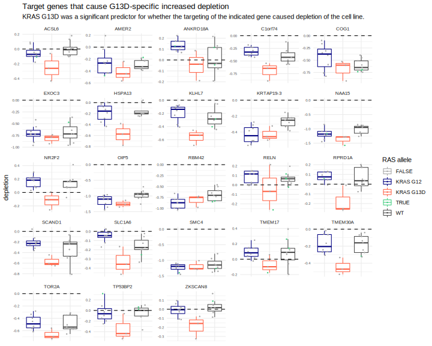
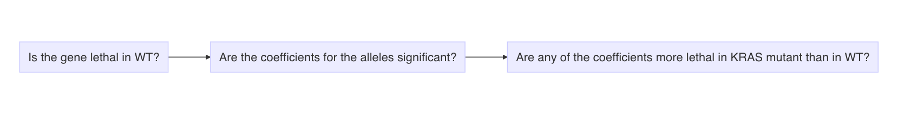
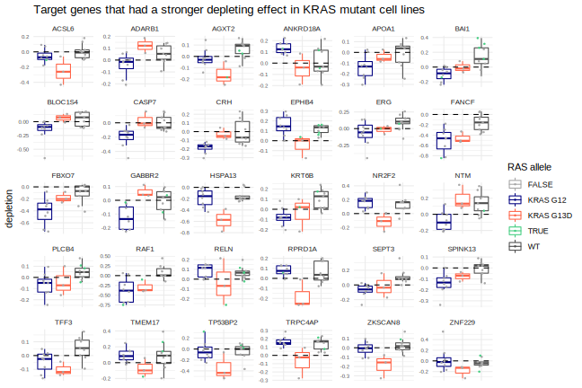
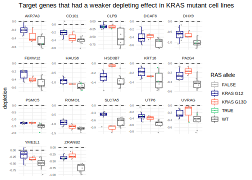
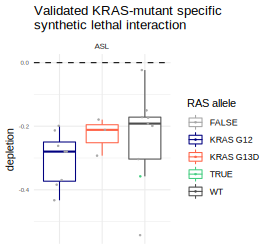
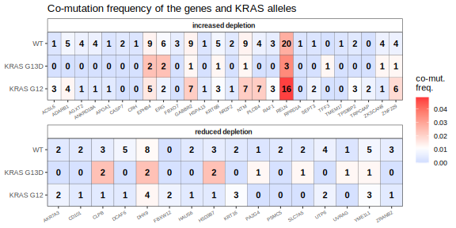
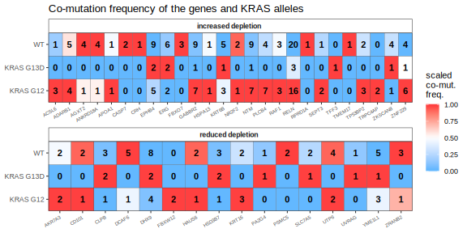

## Data

The [Dependency Mapping](https://depmap.org/portal/) project ([Howard *et al.*, 2016](http://symposium.cshlp.org/content/81/237.long); [Tsherniak *et al.*, 2017](https://www.cell.com/cell/abstract/S0092-8674(17)30651-7); [Meyers *et al.*, 2017](https://www.nature.com/articles/ng.3984)) has screened over 500 cell lines from the [Cancer Cell Line Encyclopedia (CCLE)](https://portals.broadinstitute.org/ccle) through Achilles ([Cheung *et al.*, 2011](http://www.pnas.org/cgi/pmidlookup?view=long&pmid=21746896)). Achilles is a genome-wide CRISPR-Cas9 loss-of-function screen where each gene in every cell line was knocked out with 6 different guide RNA (using the Avana sgRNA library ([Doench *et al.*, 2014](https://doi.org/10.1038/nbt.3026); [Doench *et al.*, 2016](https://www.nature.com/articles/nbt.3437))).

This second analysis only used cell lines from colorectal cancer. Cell lines with two reported *KRAS* mutations or an activating *BRAF* or *NRAS* mutation were not included. There were no cell lines removed by the filter for *KRAS* double mutants that would have otherwise been included in the study. 5 *KRAS* WT cell lines were excluded because they had activating BRAF mutations. **Overall, there were 9 *KRAS* WT cell lines, 8 *KRAS* G12 cell lines, and 3 *KRAS* G13D cell lines.**

Only genes that caused a depletion effect at or below -0.15 in at least one cell line were used for the analysis. This removed genes that never displayed a lethal effect when knocked-out. I also removed genes that report to have no gene expression.


## Model

I created models to explain the depletion effect of knocking-out a gene using variables including the *KRAS* allele, if the target gene is mutated, and gene expression (RNA-seq) of the target gene. The model I believe to be most appropriate used all of these predictors, but only includes the variable for if the gene is mutated or not if the gene is mutated in at least 4 cell lines. This condition was implemented because I noticed that some models were attributing too much weight to this variable when it was only mutated a few times. Gene expression was z-scaled for each gene. 

Some genes were disrupted by including gene expression. Therefore, I also included a model without that co-variate.

The code for the model including the target gene's expresssion is shown below. *KRAS* WT is set as the intercept. Therefore, the coefficients for *KRAS* G12 and G13D will effectively report the difference in average depletion effect in the *KRAS* mutant cell lines from that in *KRAS* WT cell lines.

```{r, eval = FALSE}
if (num_muts >= min_mut_cutoff) {
    fit <- lm(
        gene_effect ~ ras_allele + target_is_mutated + gene_expression_norm,
        data = data
    )
} else {
    fit <- lm(
        gene_effect ~ ras_allele + gene_expression_norm,
        data = data
    )
}
```

A data table of the result of running each gene through this model is available at `model_results/linear_model_4.rds`.

The following plot shows the difference between the coefficients assigned to the variables for *KRAS* G12 and G13D on the x-axis and the log-transformed p-value of the model on the y-axis. Each point is a gene targeted during the screen.


The following plot shows, for each gene (point), the coefficients assigned to the variables for *KRAS* G12 and G13D on the x and y-axes, respectively. The highlighted genes are those with a difference in coefficients of eat least 0.2 and a significant model p-value.


The box-plots below show the depletion scores in each cell line (each point) for genes (each box-plot is for a different target gene) with a statistically significant model and the *KRAS* G13D coefficient was at or below -0.15 and had a significant p-value. Therefore, these are genes that had a stronger depletion effect when target in *KRAS* G13D and in *KRAS* WT.




## Filters

The goal was to find genes that displayed *KRAS* allele-specific synthetic lethality. Therefore, I implemented the following series of filters. 



To find a depletion effect value to define the "lethality" boundary, I used the scores of pan essential and non-essential genes in the cell lines. The point of overlap of their histograms can provide a logical point to serve as the boundary here.

 

A *KRAS* allele passed the final step in the filter if it had a depletion value of either -0.1 or 0.1 lower than the average in WT,  whichever is smaller.


## Results

### Depletion

Below are the genes that passed these filters. First are the genes that caused depletion in at least one *KRAS* allele, followed by the genes that had a reduced effect when knockout-in cell lines with a *KRAS* mutation.





Below is the same box-plot for *ASL* a gene previously found to have a *KRAS* allele-specific synthetic lethal interaction.



### Co-mutation

We hypothesize that if a gene has a synthetic-lethal interaction with a *KRAS* allele, it would be less likely to mutate with that allele, *in vivo*. The heatmaps below show the rates of co-mutation between the indicates *KRAS* allele (y-axis) and the gene from the previous screen (x-axis). The color indicates the frequency of co-mutation and the integers indicate the actual number of co-mutation events.



The following is the same plot except the fill color has been scaled from blue to red within each gene.




---

## TCGA survival data

Yi-Jang was interested in the survival data from TCGA, so I helped gather the data for her.

It was downloaded from the following URL:  
http://download.cbioportal.org/coadread_tcga_pan_can_atlas_2018.tar.gz

```bash
curl -O http://download.cbioportal.org/coadread_tcga_pan_can_atlas_2018.tar.gz
mkdir coadread_tcga_pan_can_atlas_2018
mv coadread_tcga_pan_can_atlas_2018.tar.gz coadread_tcga_pan_can_atlas_2018
cd coadread_tcga_pan_can_atlas_2018
tar -xzf coadread_tcga_pan_can_atlas_2018.tar.gz
```

From these data, I created "data/survival_data.xlsx" (and a TSV) with the patient information annotated with *KRAS* allele.
